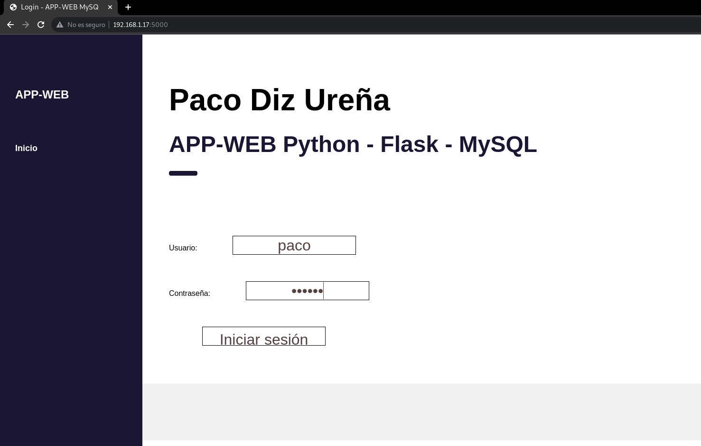
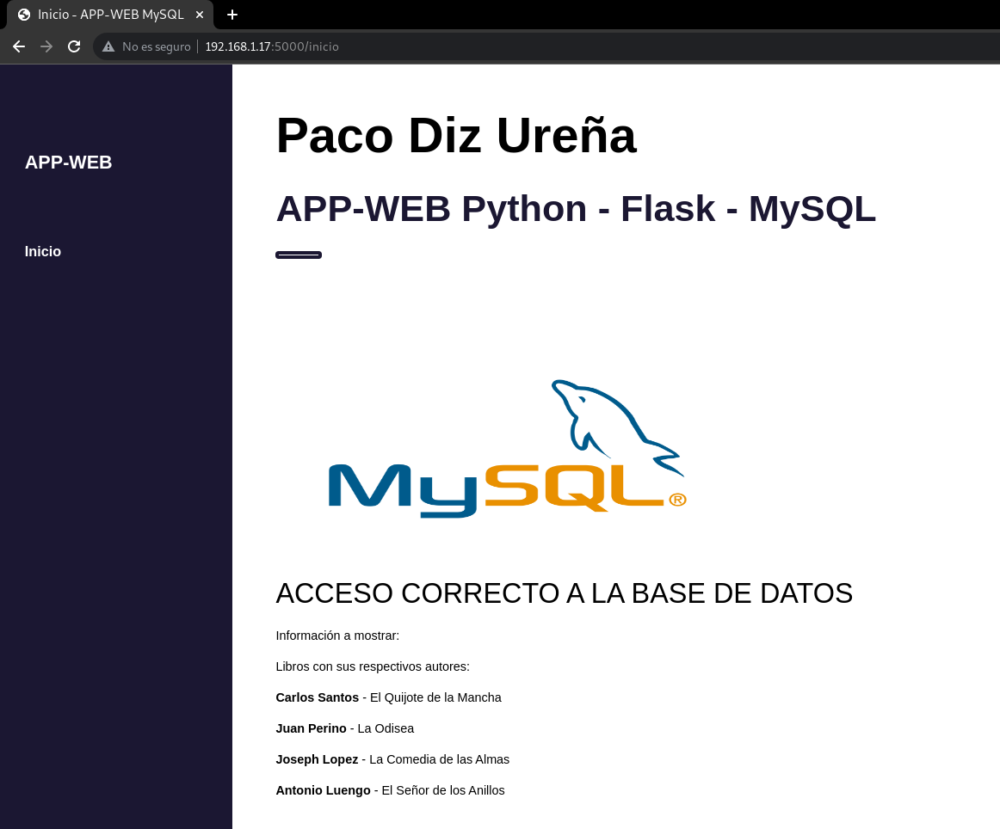

## APP WEB creada con Python3-Flask conectando con MySQL.

En primer lugar tendremos que crear un entorno virtual:

1. Instalamos `apt install python3-venv`

2. Creamos un directorio en el `/home` de nuestro usuario sin privilegios, donde crearemos los entornos virtuales.

3. Nos movdemos al directorio que creamos en el paso anterior.

4. Para crear el entorno ejecutamos `python3 -m venv nombre_entorno_virtual`.

5. Para poder utilizarlo tenemos que activarlo con `source nombre_entorno_virtual/bin/activate`

    Una vez activo se cambiará el PATH del usuario y podremos instalar con `pip` las versiones que deseemos.
    
Antes de ejecutar la aplicación tenemos que crear la base de datos:

El esquema de prueba es el siguiente: [Esquema.sql](./esquema.sql)

Ahora ejecutaremos el app.py con `python3 app.py`.

Buscaremos en el navegador la IP privada de nuestro equipo o direcramente pondremos `localhost`.

Una vez dentro podemos ver como nos ha cargado la página del login:

Y si ponemos las credenciales del usuario (en mi caso mi usuario en la base de datos se llama `paco` y tiene como contraseña `asdasd`)

Como podemos ver nos muestra la información correctamente.
